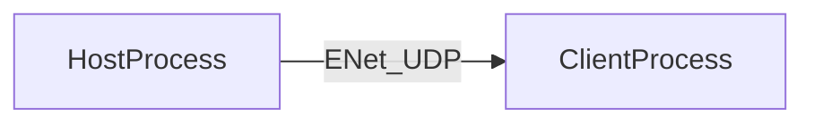

# Multiplayer

moonBASIC exposes **UDP networking through ENet** (reliable and unreliable channels). You can build **listen servers**, **outgoing clients**, **remote procedure calls**, and **optional in-process lobby descriptors**—all documented here with **registry-first** names (`SERVER.START`, `NET.START`, …). **Easy Mode** dotted names (for example `Net.Start`) are compatibility aliases; see [STYLE_GUIDE.md](../STYLE_GUIDE.md).

**Platform:** Interactive multiplayer needs the **full runtime** release from [GitHub Releases](https://github.com/CharmingBlaze/moonbasic-compiler/releases/latest) (not the compiler-only archive). Use **`moonbasic --check`** to validate scripts that call `NET.*` / `SERVER.*` without starting **`moonrun`**. Unsupported builds return explicit errors instead of silent networking.

---

## Core Workflow

1. **Pick a layer** — High-level **`SERVER.*` / `CLIENT.*`** (game-style tick + handlers), mid-level **`NET.*` / `PEER.*` / `EVENT.*`**, or **`RPC.*`** for structured calls. See **Learning path** below.
2. **Initialize once** — `NET.START()` (often implied when you call `SERVER.START` or `CLIENT.CONNECT`; still pair with `NET.STOP()` / `SERVER.STOP` / `CLIENT.STOP` on shutdown).
3. **Drive the stack every frame** — `SERVER.TICK(dt)` or `CLIENT.TICK(dt)` for the high-level API; `NET.UPDATE(host)` plus draining `NET.RECEIVE` for the mid-level API.
4. **Optional lobby metadata** — `LOBBY.*` for **in-process** session records only (see **`LOBBY.*` semantics**).

---

## Who this is for

- Authors of **small dedicated servers** or **P2P-style** games where players agree on an address/port (LAN, Discord, manual invite).
- Teams comfortable with **UDP semantics** (ordering, packet loss) and **server authority** as a design choice—not something the language enforces globally.

---

## Concepts (short)

- **Host vs peer** — A **server host** listens on a UDP port; **client hosts** initiate **outgoing peers**. The mid-level API exposes both as **handles** (`NET.CREATESERVER`, `NET.CREATECLIENT`, `NET.CONNECT`).
- **Tick loop** — Network I/O is polled from your main loop via **`SERVER.TICK` / `CLIENT.TICK`** or **`NET.UPDATE`**; there is no hidden background thread inside moonBASIC that runs your game logic.
- **Channels** — Under the hood the high-level stack uses fixed channel indices in [`runtime/net/mp_high_cgo.go`](../../runtime/net/mp_high_cgo.go): **`chUser` = 0** (plain string messages to `SERVER.ONMESSAGE` / `CLIENT.ONMESSAGE`), **`chSync` = 1** (entity sync), **`chRPC` = 2** (`RPC.*` payloads). Mid-level **`PEER.SEND`** / **`NET.BROADCAST`** take an explicit **channel** index and **reliable** flag—mirror those knobs to match ENet’s model (see [ENET.md](ENET.md) and upstream ENet documentation).



---

## Learning path

1. **Minimal transport (registry-first)** — Read **[NET.md](NET.md)** for **`SERVER.START(port, maxClients)`**, **`CLIENT.CONNECT(host, port)`**, **`SERVER.TICK(dt)`**, **`CLIENT.TICK(dt)`**, and handler registration (`SERVER.ONMESSAGE`, `CLIENT.ONMESSAGE`, …). *Easy Mode uses names like `Net.Start`; the manifest and this hub spell them `NET.START`.*
2. **Game-shaped messages** — Add **`RPC.CALL`**, **`RPC.CALLTO`**, **`RPC.CALLSERVER`** after a connection exists (see [NET.md](NET.md) RPC section). Wire traffic uses **`chRPC`**.
3. **Mid / low level** — **[NETWORK.md](NETWORK.md)** (patterns, `NET.UPDATE` / `NET.RECEIVE` loops) and **[ENET.md](ENET.md)** (legacy **`ENET.*`** names and packet broadcast).
4. **Lobby handles** — **[LOBBY.md](LOBBY.md)** only after you understand the **in-process** limitation (next section).

---

## `LOBBY.*` semantics (accurate)

- **Discovery is in-process only.** `LOBBY.FIND` walks **registered lobby objects in the current runtime** (`lobbyHandles` in [`runtime/net/mp_high_cgo.go`](../../runtime/net/mp_high_cgo.go)); it does **not** query the Internet, Steam, or a dedicated lobby service.
- **Matching rule** — `LOBBY.FIND(key$, value$)` compares **`LOBBY.SETPROPERTY`** entries: both arguments are strings; the implementation lowercases the **key** and tests **`props[key] == value`**. It is **not** a free-text “game name search” API.
- **Typical real-world pattern** — Run your **game server** on a known host/port, distribute the address out-of-band (chat, web API, Steam invite, etc.), or build a **separate matchmaking service** that your moonBASIC client talks to via HTTP/TCP/UDP that **you** provide.
- **Joining** — `LOBBY.JOIN(lobbyHandle)` uses whatever you passed to `LOBBY.SETHOST`; it ultimately calls the same path as `CLIENT.CONNECT`.

---

## What is not in the engine today

Document these as **integration tasks**, not built-ins:

- **Voice chat / WebRTC audio** — integrate Discord, Steam Voice, OpenAL capture + your own transport, etc.
- **Global matchmaking / cloud lobby browser** — requires an external service or peer-discovery layer you host.
- **Authoritative anti-cheat** — validate inputs on a server you control; the language does not ship kernel-level protections.

---

## Your first session (two terminals)

Step-by-step (two terminals, `127.0.0.1`, `moonrun`, firewall): **[FIRST_MULTIPLAYER_GAME.md](../tutorials/FIRST_MULTIPLAYER_GAME.md)**. Summary:

1. **Pick a UDP port** (for example `27777`) that is free on **Windows** (check Windows Defender Firewall prompts on first run).
2. **Run a server program** on `127.0.0.1` / `localhost` binding that port (mid-level `NET.CREATESERVER` or high-level `SERVER.START`).
3. **Run a client** in another process that connects to `127.0.0.1` with the same port.
4. **Loop** — Call `NET.UPDATE` + `NET.RECEIVE` (mid-level) or `SERVER.TICK` / `CLIENT.TICK` (high-level) every frame until you see connect / receive events.
5. **Sanity check** — From the repo root, the checked-in samples compile cleanly:
   - **High-level:** `moonbasic --check testdata/mp_host.mb` and `moonbasic --check testdata/mp_client.mb`
   - **Mid-level:** `moonbasic --check testdata/net_server.mb` and `moonbasic --check testdata/net_client.mb`
   - **Legacy `ENET.*`:** `moonbasic --check testdata/enet_smoke.mb`

---

## Full Example

### High-level `SERVER.*` / `CLIENT.*` + `RPC.CALLSERVER`

These use **registry-first** names. User handlers are ordinary **`FUNCTION`** definitions (see [NET.md](NET.md)); the client sends one RPC after `CLIENT.ONCONNECT` fires.

**Host (`testdata/mp_host.mb`):**

```basic
SERVER.START(27777, 8)
done = 0
WHILE done = 0
    SERVER.TICK(0.016)
WEND
SERVER.STOP()

FUNCTION PING(msg, peerH)
    done = 1
ENDFUNCTION
```

**Client (`testdata/mp_client.mb`):**

```basic
CLIENT.CONNECT("127.0.0.1", 27777)
CLIENT.ONCONNECT("ONCONNECTED")
FUNCTION ONCONNECTED()
    RPC.CALLSERVER("PING", "hello")
ENDFUNCTION
i = 0
WHILE i < 2000
    CLIENT.TICK(0.016)
    i = i + 1
WEND
CLIENT.STOP()
```

On the server, the RPC layer appends the **peer handle** after the JSON-decoded arguments, so `PING` is invoked as **`(msg, peerH)`** (see [`handleRPCPacket`](../../runtime/net/mp_high_cgo.go)).

---

### Mid-level `NET.*` / `PEER.*` / `EVENT.*`

The smallest **CI-checked** JSON round-trip uses the mid-level API under `testdata/`. It uses **Easy Mode** identifiers (`Net.Start`, `Net.CreateServer`, …); the registry spellings are `NET.START`, `NET.CREATESERVER`, `NET.CREATECLIENT`, `NET.CONNECT`, `NET.UPDATE`, `NET.RECEIVE`, `NET.CLOSE`, `NET.STOP`, `Peer.Send`, `Event.*`.

**Host (`testdata/net_server.mb`):**

```basic
Net.Start()
port = 27777
server = Net.CreateServer(port, 32)
done = 0
WHILE done = 0
    Net.Update(server)
    ev = Net.Receive(server)
    IF ev <> 0 THEN
        ty = Event.Type(ev)
        IF ty = 3 THEN
            raw = Event.Data(ev)
            rp = Event.Peer(ev)
            jin = JSON.Parse(raw)
            IF JSON.GetString(jin, "op") = "hello" THEN
                jout = JSON.Create()
                JSON.SetString(jout, "op", "ack")
                JSON.SetString(jout, "msg", "ok")
                outJson = JSON.ToString(jout)
                Peer.Send(rp, 0, outJson, TRUE)
                JSON.Free(jout)
            ENDIF
            JSON.Free(jin)
        ENDIF
        IF ty = 2 THEN
            done = 1
        ENDIF
        Event.Free(ev)
    ENDIF
WEND
Net.Close(server)
Net.Stop()
```

**Client (`testdata/net_client.mb`):**

```basic
Net.Start()
port = 27777
client = Net.CreateClient()
peer = Net.Connect(client, "127.0.0.1", port)
connected = 0
sent = 0
gotack = 0
iter = 0
WHILE gotack = 0 AND iter < 5000
    iter = iter + 1
    Net.Update(client)
    ev = Net.Receive(client)
    IF ev <> 0 THEN
        ty = Event.Type(ev)
        IF ty = 1 THEN
            connected = 1
        ENDIF
        IF ty = 3 THEN
            raw = Event.Data(ev)
            jr = JSON.Parse(raw)
            IF JSON.GetString(jr, "op") = "ack" THEN
                gotack = 1
            ENDIF
            JSON.Free(jr)
        ENDIF
        Event.Free(ev)
    ENDIF
    IF connected = 1 AND sent = 0 THEN
        j = JSON.Create()
        JSON.SetString(j, "op", "hello")
        JSON.SetString(j, "from", "client")
        payload = JSON.ToString(j)
        Peer.Send(peer, 0, payload, TRUE)
        JSON.Free(j)
        sent = 1
    ENDIF
WEND
Peer.Disconnect(peer)
iter2 = 0
WHILE iter2 < 200
    iter2 = iter2 + 1
    Net.Update(client)
    ev = Net.Receive(client)
    IF ev <> 0 THEN
        Event.Free(ev)
    ENDIF
WEND
Net.Close(client)
Net.Stop()
```

More **`SERVER.*` / `CLIENT.*`** patterns (plain string messages on channel 0, sync, etc.) are in **[NET.md](NET.md)**.

---

## See also

- [FIRST_MULTIPLAYER_GAME.md](../tutorials/FIRST_MULTIPLAYER_GAME.md) — two-process tutorial (`moonrun`, same machine).
- [LOBBY.md](LOBBY.md) — lobby handles (read the **Scope** section first).
- [NET.md](NET.md) — `SERVER.*`, `CLIENT.*`, `NET.*`, `RPC.*`, `PEER.*`.
- [NETWORK.md](NETWORK.md) — mid-level ENet workflow and naming notes.
- [ENET.md](ENET.md) — **`ENET.*`** legacy aliases (`ENET.CREATEHOST`, …).
- [NET_ZERO_CGO.md](../architecture/NET_ZERO_CGO.md) — builds without CGO.
- [PACKAGES.md](../PACKAGES.md) — packaging binaries that link native code.
